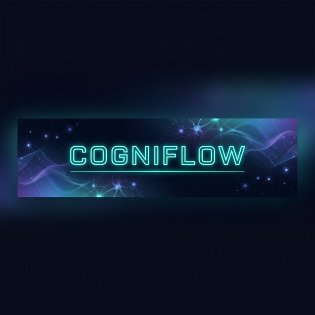
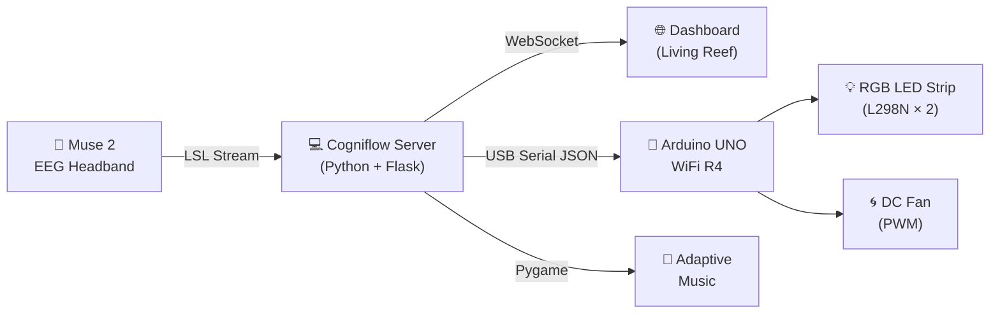

<h1 align="center">
    </img>
    <br/>Cogniflow
</h1>
<p align="center">
  A <strong>real-time EEG biofeedback system</strong> that classifies cognitive states and adapts your physical environment — lighting, airflow, and music — to optimise focus, reduce stress, and combat drowsiness.
  <br/><br/>
  Built with <strong>Muse 2</strong> · <strong>Arduino UNO WiFi R4</strong> · <strong>Flask + SocketIO</strong> · <strong>Living Reef Engine</strong>
</p>

<p align="center">
  <a aria-label="Python version" href="https://www.python.org/downloads/release/python-3130/">
    </img>
  </a>
  <a aria-label="Flask" href="https://flask.palletsprojects.com/">
    </img>
  </a>
  <a aria-label="Arduino" href="https://www.arduino.cc/">
    </img>
  </a>
  <a aria-label="License" href="./LICENSE">
    </img>
  </a>
</p>

---

## 📄 Abstract

> Traditional productivity tools rely on self-reporting and manual timers — but your brain already knows when you're focused, drowsy, or stressed. **Cogniflow** reads that signal directly.

> Using a consumer-grade **Muse 2 EEG headband**, Cogniflow captures real-time brainwave data (Theta, Alpha, Beta bands), classifies your cognitive state using scientifically-grounded indices (NASA Engagement Index, Fatigue Index, Stress Ratio), and then **physically transforms your environment** to guide you back to an optimal state:

> - 🟢 **FOCUS** — Cool purple LEDs · No fan · Ambient lo-fi music
> - 🟡 **DROWSY** — Bright yellow LEDs · Full-blast fan · Upbeat music
> - 🔴 **STRESSED** — Calming teal LEDs · Gentle breeze · Rain sounds
> - 🔵 **RELAXED** — Warm amber LEDs · No fan · Gentle piano

> The system features a **Living Reef** — a real-time generative coral ecosystem rendered on a web dashboard that grows, sways, and bleaches in response to your mental state, creating a beautiful biofeedback visualisation.

---

## 🧠 How It Works



### Signal Processing Pipeline

| Step | Process | Details |
|:----:|---------|---------|
| 1 | **Acquire** | 4-channel EEG at 256 Hz via Lab Streaming Layer (LSL) |
| 2 | **Calibrate** | 60-second personal baseline — no absolute thresholds |
| 3 | **Extract** | Welch's PSD → Theta (4–8 Hz), Alpha (8–13 Hz), Beta (13–30 Hz) |
| 4 | **Normalise** | All powers expressed as multiples of _your_ baseline |
| 5 | **Classify** | Fatigue Index · NASA Engagement · Stress Ratio |
| 6 | **Hysteresis** | 8 consecutive matching epochs (~2s) before state change |
| 7 | **Actuate** | LED colour + Fan speed + Music track + Dashboard update |

---

## 🔧 Hardware Requirements


| Component | Purpose |
|-----------|---------|
| **Muse 2 headband** | 4-channel EEG acquisition (TP9, AF7, AF8, TP10) |
| **Arduino UNO WiFi R4** | USB serial bridge → L298N motor drivers |
| **L298N Motor Driver × 2** | PWM control of RGB LED strip channels + DC fan |
| **12V RGB LED strip** | Therapeutic phototherapy lighting |
| **5V / 12V DC fan** | Cooling airflow for drowsiness intervention |
| **12V power supply** | Drives LED strip and fan via L298N |

### Pin Mapping (Arduino)

| L298N | Pin | Function |
|:-----:|:---:|----------|
| #1 ENA | 9 | Red LED PWM |
| #1 IN1/IN2 | 4 / 2 | Red direction |
| #1 ENB | 10 | Green LED PWM |
| #1 IN3/IN4 | 6 / 7 | Green direction |
| #2 ENA | 3 | Blue LED PWM |
| #2 IN1/IN2 | 11 / 12 | Blue direction |
| #2 ENB | 5 | Fan PWM |
| #2 IN3/IN4 | 8 / 13 | Fan direction |

---

## ⚡ State Configuration

Each cognitive state triggers a unique combination of actuator responses:

| State | LED Colour | Fan Speed | Music | Rationale |
|:-----:|:----------:|:---------:|:-----:|-----------|
| 🟢 FOCUS | Purple `(80, 0, 120)` | 150 (Med) | Lo-fi ambient | Low-arousal lighting sustains deep work |
| 🟡 DROWSY | Yellow `(255, 180, 0)` | 0 (Off) | Upbeat | Bright light suppresses melatonin |
| 🔴 STRESSED | Teal `(0, 120, 120)` | 255 (High) | Rain / calm | Parasympathetic activation + cooling lowers heart rate |
| 🔵 RELAXED | Amber `(200, 80, 0)` | 90 (Low) | Gentle piano | Simulates sunset warmth, sustains alpha |

---

## 🚀 Setup

### Prerequisites

```bash
# Ensure Muse LSL bridge is available
pip install muselsl

# Core dependencies
pip install flask flask-socketio pylsl scipy numpy pygame pyserial
```

### Installation

```bash
git clone https://github.com/your-username/Cogniflow.git
cd Cogniflow
```

### Audio Tracks

Place MP3 files in the `audios/` directory:

```
audios/
├── focus.mp3       # Lo-fi ambient / sci-fi
├── drowsy.mp3      # Upbeat, energising
├── stressed.mp3    # Rain, calming ambient
└── relaxed.mp3     # Gentle piano
```

### Arduino Sketch

1. Open `cogniflow_arduino/cogniflow_arduino.ino` in the Arduino IDE
2. Install **ArduinoJson** via Library Manager
3. Upload to your Arduino UNO WiFi R4

---

## ▶️ Running

```bash
# Terminal 1 — Start the Muse LSL stream
muselsl stream

# Terminal 2 — Launch Cogniflow
python3 cogniflowServer.py
```

The dashboard will be available at **[`http://localhost:5000`](http://localhost:5000)**

### Expected Output

```
  [ COGNIFLOW ]  EEG thread started.
  Dashboard → http://localhost:5000

  [ ARDUINO ]  Auto-detected port: /dev/ttyACM1
  [ ARDUINO ]  Connected on /dev/ttyACM1

  [ CALIBRATING ]  Sit still, eyes open — 60s baseline...
  [ BASELINE SET ]  θ=0.0023  α=0.0041  β=0.0019

  [ RUNNING ]  Live classification active.
```

---

## 📁 Project Structure

```
Cogniflow/
│
├── cogniflowServer.py         # Main server — EEG pipeline, Flask, SocketIO, music
├── cogniflowDashboard.html    # Dashboard UI — Living Reef, brainwave bars, analytics
├── cogniflowGame.js           # Living Reef generative coral engine (Canvas 2D)
│
├── config.py                  # All configuration — thresholds, colours, fan speeds
├── arduinoController.py       # USB serial bridge — auto-detect + JSON protocol
├── bandClassifier.py          # EEG band power extraction + state classification
│
├── cogniflow_arduino/
│   └── cogniflow_arduino.ino  # Arduino firmware — RGB LED + fan via L298N
│
├── audios/                    # Therapeutic music tracks (MP3)
│   ├── focus.mp3
│   ├── drowsy.mp3
│   ├── stressed.mp3
│   └── relaxed.mp3
│
├── assets/                    # README assets
│   └── banner.png
│
└── README.md
```

---

## 🧪 Classification Logic

The classifier uses **relative** (personalised) thresholds — never absolute µV values.

```python
# Established neuroscience indices
fatigue    = (θ + α) / (β + ε)      # High → DROWSY
engagement = β / (θ + α + ε)        # High → FOCUS  (NASA Engagement Index)
stress     = β / (α + ε)            # High → STRESSED

# Priority order: DROWSY → FOCUS → STRESSED → RELAXED (default)
```

| Threshold | Config Key | Default | Meaning |
|-----------|-----------|:-------:|---------|
| Fatigue Index | `DROWSY_FATIGUE_INDEX` | 2.5 | (θ+α)/β above this → DROWSY |
| Stress Ratio | `STRESSED_BETA_ALPHA` | 1.8 | β/α above this → STRESSED |
| Focus α suppression | `FOCUS_ALPHA_SUPPRESS` | 0.7 | α must drop below 0.7× baseline |
| Focus engagement | `FOCUS_BETA_ELEVATE` | 1.2 | β/(θ+α) must exceed this |
| Hysteresis | `HYSTERESIS_EPOCHS` | 8 | ~2s of sustained state before switching |

---

## 🔌 Serial Protocol

Communication between the Python server and Arduino uses newline-delimited JSON over USB:

```
Laptop → Arduino:  {"state":"FOCUS","fan":0,"r":80,"g":0,"b":120}\n
Arduino → Laptop:  ACK:FOCUS\n
```

The Arduino port is **auto-detected** — no manual configuration needed.

---

## 🛠️ Configuration

All tuneable parameters live in **`config.py`** — the single source of truth:

| Section | What you can change |
|---------|-------------------|
| EEG Hardware | Sample rate, epoch size, shift |
| Frequency Bands | Theta, Alpha, Beta ranges (Hz) |
| Classification | Fatigue, stress, focus thresholds |
| Hysteresis | Epochs required before state change |
| Arduino | Port, baud rate, fan speeds, LED colours |
| Music | Track paths, volume level |

---

## 🌊 The Living Reef

The dashboard features a **generative coral reef ecosystem** rendered in real-time on HTML5 Canvas. The reef responds to your cognitive state:

| State | Reef Behaviour |
|:-----:|---------------|
| 🟢 FOCUS | Coral grows rapidly, vibrant colours, active fish |
| 🟡 DROWSY | Growth slows, colours dim, fewer particles |
| 🔴 STRESSED | Coral bleaches white, harsh lighting |
| 🔵 RELAXED | Gentle swaying, warm bioluminescence |

---

## 📜 License

All source code is made available under the MIT License. You can freely use and modify the code, without warranty, so long as you provide attribution to the author.

---

<p align="center">
  Made with 🧠 + ❤️ by <strong>Ronel</strong>
</p>